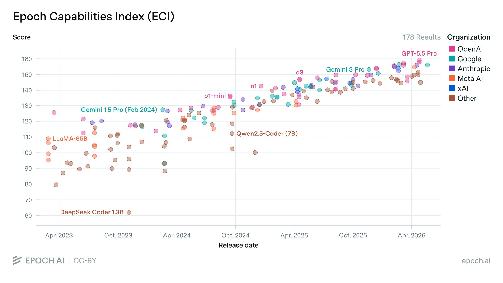
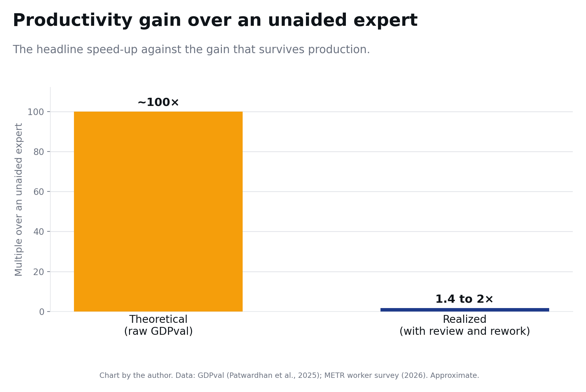
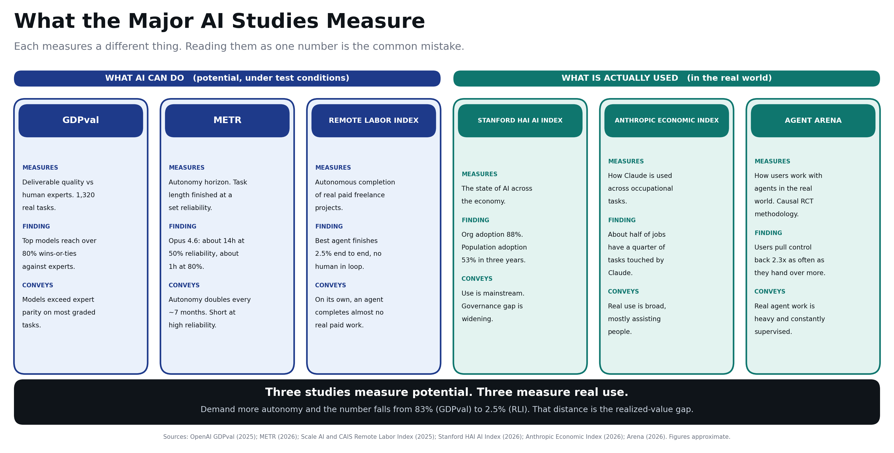
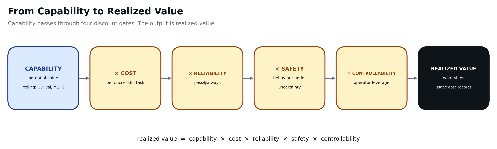
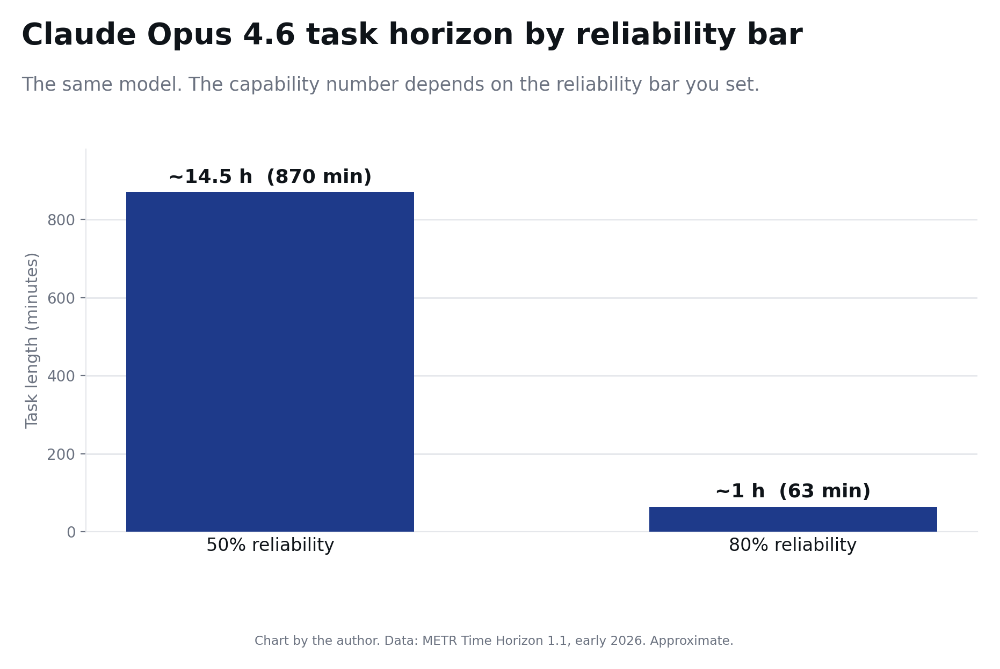
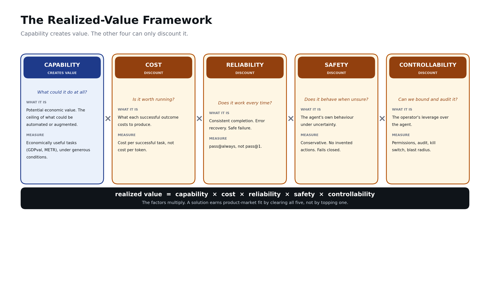

# Realized Value: A Framework for Evaluating Agentic AI in the Enterprise

*Capability is the only term that creates value. Everything else is a discount. The binding constraint is whichever factor sits closest to zero, usually one of the other four.*

---

My team and I work with enterprises across industries. We talk to the users who stand to gain from agentic AI. We build the tooling layer beneath these solutions. And we follow each advance in LLM capability and the shifts in value across the stack.

This series is my attempt to write down what we keep seeing. Frontier capability is growing fast. Investment and market value are growing with it. Yet most enterprises still struggle to put agentic AI into production. That gap is the subject of these articles.



## What GDPval says

In late 2025, OpenAI released [GDPval](https://arxiv.org/abs/2510.04374). It is 1,320 tasks across 44 occupations, drawn from the nine sectors that contribute most to U.S. GDP and over $3 trillion in annual wages. Each task is a real deliverable: a financial model, a legal review, a consulting report. A professional with about 14 years of experience built each one. Each took roughly seven hours. Experts then judged the model outputs blind, marking each as better than, equal to, or worse than the human's ([Patwardhan et al., 2025](https://arxiv.org/abs/2510.04374)).

At the September 2025 release, Claude Opus 4.1 led at 47.6% wins-or-ties against the human expert. By mid-2026, the leaderboard's top score has climbed to around 83% ([OpenAI GDPval Leaderboard, 2026](https://evals.openai.com/gdpval/leaderboard); [Patwardhan et al., 2025](https://arxiv.org/abs/2510.04374)). Seven hours of expert work returns from a model in minutes, a theoretical speed-up near 100x.[^data]

That is what GDPval says: the capability already exists for a large share of valuable knowledge work.

## What translates

Now set that against a second number. Gartner expects over 40% of agentic AI projects to be cancelled before production by 2027. The drivers are cost and complexity ([Gartner, 2025](https://www.gartner.com/en/newsroom/press-releases/2025-06-25-gartner-predicts-over-40-percent-of-agentic-ai-projects-will-be-canceled-by-end-of-2027)).

Both numbers are true at once. The gap between them is this series. Production adds what the benchmark ignores. A human reviews the output. Someone reworks it when it is wrong. The agent costs money at volume. Controls keep it safe and contained. Count all of that and the advantage shrinks. METR's survey of 349 technical workers found a median 1.4 to 2x change in the value of their work, down from the theoretical 100x ([METR, 2026](https://metr.org/)).



A third measure marks the floor. The Remote Labor Index, from Scale AI and the Center for AI Safety, scores end-to-end autonomous completion of real freelance projects. About 240 paid projects, over $140,000 of real work. The best agent finishes 2.5% of them at acceptable quality. Most land between 0.8% and 2.5% ([Scale AI and CAIS, 2025](https://arxiv.org/abs/2510.26787); [Scale](https://scale.com/research/rli)).

These numbers measure different things. They sit on an autonomy spectrum. GDPval grades a single deliverable against an expert. The 1.4 to 2x gain assumes a human in the loop. RLI removes the human and asks for a finished project. Read together they tell one story. High deliverable quality. A modest gain with a person reviewing. Near-zero completion on the agent's own.

GDPval measures a ceiling. The enterprise lives in the gap between that ceiling and the 1.4 to 2x. Capability is what the benchmark shows. Value is what survives production. Four things govern the difference: cost, reliability, safety, and controllability.

The benchmark builders now name this gap themselves. Stanford's 2026 Index highlights the distance between what models can do and how ready organisations are to govern them ([Stanford HAI, 2026](https://hai.stanford.edu/ai-index)). METR notes that fast benchmark gains have not translated into workflow automation, because long chains of actions are still hard to run reliably ([METR, 2025](https://metr.org/blog/2025-03-19-measuring-ai-ability-to-complete-long-tasks/)). Agent Arena, observing 160,480 real-world agent sessions, finds users pull control back about 2.3x as often as they hand over more ([Arena, 2026](https://arena.ai/blog/agent-arena-methodology/)).



The series asks one question. How much of the model's capability survives contact with production.

## The mental model

This is a mental model. It guides judgment about which factor binds. The shape is simple:

```
realized value  =  capability  ×  cost  ×  reliability  ×  safety  ×  controllability
```

Only cost has a clean unit, the dollar. The other terms resist a single honest number. The model reveals what a scorecard hides: the factors multiply, so one near-zero factor zeros the product.

Capability is the only term that creates value. The other four can only subtract it. An agent with high capability and zero controllability ships nothing. An agent you cannot afford, trust, or audit is worth nothing, whatever the first term reads. The binding constraint is whichever factor sits nearest zero, usually one of the other four.

How much each factor matters depends on the use case and the sector. The same model on the same task carries different weights. What changes is the cost of error. Three versions of one tool show this.

- A meeting-notes summariser for internal standups. A human always reviews the output. Mistakes surface in seconds. The content stays inside the organisation. Safety and controllability barely register. Cost and reliability decide if it is worth running.
- The same summariser on patient charts or audited financial filings. Now a dropped contraindication or an invented figure is a clinical or regulatory incident. Safety and reliability move to the front. The deployment needs rigorous safety testing before it ships. Same model, same capability. The weights inverted because the stakes did.
- An agent that places trades or submits orders. Controllability leads: permissions, reversibility, blast radius, a human in the loop on anything irreversible. Even a capable, low-cost, accurate model ships only when you can bound what it does when it is wrong.

Weights follow consequences. A summariser is low stakes only until you point it at something that matters. These weights are judgment calls, set by the deployment. The framework points at one question: which factor is your binding constraint, in your sector. The mechanics belong in the capability deep dive.

## How the factors determine the outcome

Capability enters as potential, the ceiling that GDPval and METR measure. Each discount factor is a gate. What leaves the last gate is realized value: what ships, and what the usage data later records.



The gates multiply, so the outcome follows the most-closed gate. One near-zero factor takes an expert-parity model to a rounding error. The opening question is which factor binds. The model sets the ceiling. Your binding constraint sets the rest.

## Capability: the ceiling

Capability is the potential economic value, the ceiling of what could be automated or augmented. The discipline is in how you measure it.

Measure it on economically useful tasks: GDPval-style occupational work ([Patwardhan et al., 2025](https://arxiv.org/abs/2510.04374)), METR-style autonomy horizons ([METR, 2026](https://metr.org/time-horizons/)). Abstract benchmarks like MMLU measure something different. Measure it under generous conditions: best effort, ideal scaffold, no time pressure. That keeps the number a clean ceiling. Measure it at a success-rate threshold instead and you fold reliability into the top line, then double-count it later. METR shows this. Claude Opus 4.6 has a task horizon near 14 hours at 50% reliability. At 80% it drops to about 1 hour. The same model's capability falls by an order of magnitude. Only the reliability bar changed ([METR, 2026](https://metr.org/blog/2026-1-29-time-horizon-1-1/)).



Two consequences. First, capability is a system property, emerging from the model and its scaffold. The harness is usually the first lever to reach for. Second, adoption sits downstream of capability. The Anthropic Economic Index tracks what people use agents for. That is the product of all five terms, an output read after the fact ([Anthropic, 2026](https://www.anthropic.com/research/economic-index-march-2026-report)).

## The four discounts

Each one multiplies. Each erodes potential toward what deploys.

**Cost.** The right unit is cost per successful task, with retries and failures counted in. An agent that costs more than the labour it replaces zeros the product. Cost is the first deep dive, the one factor whose math aggregates cleanly.

**Reliability.** Does the agent finish consistently. Does it recover from mid-task errors. Does it fail safely when it cannot. Benchmarks report pass@1. Production needs pass@always.

**Safety.** The agent's own behaviour. Conservative under ambiguity. No invented actions. Asks before high-stakes steps. Fails closed. Safety is a property of how the system behaves.

**Controllability.** The operator's leverage. Permissions, sandboxing, audit trails, kill switches, blast radius, human-in-the-loop checkpoints. What you can do to constrain the agent.

A note on security. It sits across safety and controllability. Adversarial resistance is a different threat model from the agent's behaviour or the operator's controls.



## A note on integration complexity

Real agents work across many systems: CRM, ITSM, SharePoint, email, and more. Integration complexity changes the weights on the factors you already have, unevenly.

- Reliability takes the largest hit. Every system is a new failure surface. APIs rate-limit. Tokens expire. Schemas change. An agent chained across five systems is only as reliable as its flakiest dependency, and failures compound across steps.
- Cost rises next. Tool schemas sit in context on every call. More systems mean more calls and more retries per task.
- Controllability gets harder. Each connection is a new permission scope, a new blast radius, and a new audit trail.
- Capability sets a floor. The agent must operate each tool correctly. This is rarely where the deployment fails.

One part falls outside the model. Cost per successful task is an operating cost. Building and maintaining connectors is a fixed cost. It sits in total cost of ownership, and realized value must amortize it. A small per-task cost can rest on a large integration bill.

So high integration complexity raises the weights on reliability, cost, and controllability, whatever the task looks like on its own.

## A successful solution addresses all of them

This is the core of what I have learned. A successful agentic solution addresses every factor. That is product-market fit here.

The reason is the multiplication. A solution strong on capability and weak on controllability does not ship. A near-zero factor takes the whole product down. So fit means clearing every factor the use case weights.

The adopter cares about all of them at once. Inside the organisation, different teams gate different pillars. Finance looks at cost. The CISO looks at controllability and security. Governance and risk look at safety. Product and engineering look at capability and reliability. Each weak factor meets a real veto from a real team. A solution earns fit only when it answers all of them.

## Honest limits

This framework is a diagnostic tool. It finds your binding constraint.

- The factors trade off. Cutting cost can cost capability. Tighter controllability can cost latency. A more conservative safety posture can cost capability at the margin.
- Only cost aggregates cleanly. You can multiply a routing saving by a caching saving and the math holds. Safety and controllability resist that arithmetic.
- It points at where to look. Finding the binding constraint starts the work, and directs effort at the factor setting your ceiling.

## The series

Five deep dives. Each pins its claims to named evidence and calls out the traps.

1. **Capability.** Realising the ceiling instead of buying it.
2. **Cost.** Cost per successful task. *(published)*
3. **Reliability.** pass@always, and why it lags capability.
4. **Safety.** The agent's behaviour under uncertainty.
5. **Controllability.** The operator's leverage, and where security fits.

Capability sets the ceiling. The other four decide how much of it you keep.

---

## References

**Capability instruments**

- Patwardhan et al. [GDPval: Evaluating AI Model Performance on Real-World Economically Valuable Tasks](https://arxiv.org/abs/2510.04374) (arXiv 2510.04374, Oct 2025). [OpenAI announcement](https://openai.com/index/gdpval/) (Sep 2025). [OpenAI GDPval Leaderboard](https://evals.openai.com/gdpval/leaderboard) (live). [GDPval-AA leaderboard, Artificial Analysis](https://artificialanalysis.ai/evaluations/gdpval-aa).
- METR. [Measuring AI Ability to Complete Long Tasks](https://metr.org/blog/2025-03-19-measuring-ai-ability-to-complete-long-tasks/) (Mar 2025). [Time Horizon 1.1](https://metr.org/blog/2026-1-29-time-horizon-1-1/) (Jan 2026). [Task-Completion Time Horizons](https://metr.org/time-horizons/).
- Scale AI and Center for AI Safety. [Remote Labor Index](https://arxiv.org/abs/2510.26787) (arXiv 2510.26787, Oct 2025). Autonomous completion of real freelance work; 2.5% best-agent automation rate. [Scale](https://scale.com/research/rli).
- Lee and Emberson. [Epoch Capabilities Index](https://epoch.ai/eci) (Epoch AI, live since Oct 2025). Composite capability scale stitching 40+ benchmarks. Methodology paper: [A Rosetta Stone for AI Benchmarks](https://arxiv.org/abs/2512.00193) (arXiv 2512.00193).

**Realized-usage and economy-wide observations**

- Anthropic. [Introducing the Anthropic Economic Index](https://www.anthropic.com/news/the-anthropic-economic-index) (Feb 2025). [Economic Index report, March 2026](https://www.anthropic.com/research/economic-index-march-2026-report).
- Stanford HAI. [The 2026 AI Index Report](https://hai.stanford.edu/ai-index/2026-ai-index-report). [AI Index overview](https://hai.stanford.edu/ai-index).
- Gartner. [Over 40% of Agentic AI Projects Will Be Canceled by End of 2027](https://www.gartner.com/en/newsroom/press-releases/2025-06-25-gartner-predicts-over-40-percent-of-agentic-ai-projects-will-be-canceled-by-end-of-2027) (Jun 2025). Industry cancellation projection.
- Arena Team. [Agent Arena: Causal Evaluation of Agents in the Real World](https://arena.ai/blog/agent-arena-methodology/) (Jun 2026). Causal RCT methodology on 160,480 in-the-wild agent sessions; reining-in, bluffing, bluster, cost-vs-performance Pareto.

[^data]: All figures were retrieved and last verified in June 2026. Several refresh over time, notably the METR task horizon and the GDPval and METR productivity multiples. Verify against the primary sources in the References before republishing.
